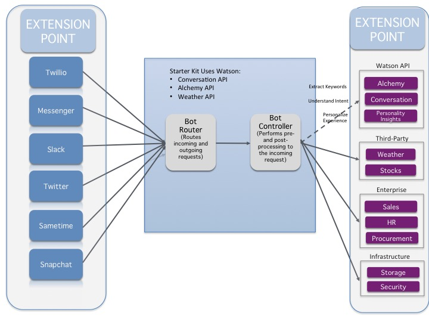

# Text Bot

<p align="center">
  
</p>

## Installation

This project is forked from the [Text Message Bot Starter Kit](https://www.ibm.com/watson/developercloud/starter-kits.html#text-message-chatbot) (SK), which is designed to get you up and running quickly with a common industry pattern, and to provide information and best practices around Watson services and bots. This application demonstrates how the Conversation service can be used with different bot kits -- such as those from Facebook and Twilio -- to enable users to have an intuitive and natural conversation with the bots. The use case for this starter kit is around booking flights. The application demonstrates how to use a third-party API to retrieve flight information from Skyscanner with data that is captured from the conversation.

## Table of Contents
 - [Getting Started](#getting-started)
 - [Installing the bots](#installing-the-bots)
 - [Running the application locally](#running-locally)
 - [Adapting/Extending the Starter Kit](#adaptingextending-the-starter-kit)
 - [Best Practices](#best-practices)
 - [Troubleshooting](#troubleshooting)
 - [Debugging the application](#debugging-the-application)

## Getting Started

This application is written in [Node.js](http://nodejs.org/) and uses the [npm](https://www.npmjs.com/), the Node Package Manager, command to install a software development kit (SDK) for the Watson Developer Cloud services, as well as to satisfy other dependencies. The following instructions include instructions for downloading and installing these.

1. Log into GitHub and clone [the repository for this application](https://github.com/eciggaar/text-bot). Change to the folder that contains your clone of this repository.

2. [Create a Bluemix Account](sign_up) if you do not already have one, or use an existing account.

3. If it is not already installed on your system, download and install the [Cloud-foundry command-line interface (CLI)][cloud_foundry] tool.

4. If it is not already installed on your system, install [Node.js](http://nodejs.org/). Installing Node.js will also install the `npm` command. Make sure to use node version 4.2.1 or later, as specified in `package.json`, or you may run into problems when installing other mandatory Node.js packages.

5. <a name="edityml">Edit the `manifest.yml` file</a> in the folder that contains your clone of the repository and replace `<application-name>` with a unique name for your copy of the application. The name that you specify determines the application's URL, such as `application-name.mybluemix.net`. The relevant portion of the `manifest.yml` file looks like the following:

        declared-services:
        conversation-service:
          label: conversation
          plan: free
        cloudantNoSQLDB-service:
          label: cloudantNoSQLDB
          plan: Shared
        applications:
          - services:
            - conversation-service
            - cloudantNoSQLDB-service
          name: <application-name>
          command: npm start
          path: .
          memory: 512M

6. Connect to Bluemix by running the following commands in a terminal window:

     ```bash
     cf api https://api.ng.bluemix.net
     cf login -u <your-Bluemix-ID> -p <your-Bluemix-password>
     ```

7. Create instances of the services that are used by the application.

     - Create an instance of the [Conversation][conversation] service by running the following command:

     `cf create-service conversation free conversation-service`

     - Create an instance of the [Cloudant NoSQL database](cloudantNoSQLDB) service by running the following command:

     `cf create-service cloudantNoSQLDB Lite cloudantNoSQLDB-service`

8. Create and retrieve service keys to access the Conversation service:

        cf create-service-key conversation-service myKey
        cf service-key conversation-service myKey

9. Create and retrieve service keys for the Cloudant service:

        cf create-service-key cloudantNoSQLDB-service myKey
        cf service-key cloudantNoSQLDB-service myKey

10. A file named `.env` file is used to provide the service keys for your service instances to the application. Create a `.env` file in the root directory of your clone of the project repository by copying the sample `.env.example` file using the following command:

        cp .env.example .env

    The `.env` file will look something like the following:

        USE_WEBUI=true

        #CONVERSATION EU-GB DEPLOYMENT
        CONVERSATION_URL=https://gateway.watsonplatform.net/conversation/api
        CONVERSATION_USERNAME=
        CONVERSATION_PASSWORD=
        WORKSPACE_ID=

        #SKYSCANNER
        SKYSCANNER_URL=http://partners.api.skyscanner.net/apiservices/pricing/v1.0
        SKYSCANNER_API_KEY=
        SKYSCANNER_COUNTRY=NL
        SKYSCANNER_CURRENCY=EUR
        SKYSCANNER_LOCALE=nl-NL
        SKYSCANNER_SCHEMA=iata

        #SLACK
        USE_SLACK=false
        SLACK_TOKEN=

        #CLOUDANT
        CLOUDANT_URL=

11. The Conversation service must be trained before you can successfully use this application. The training data is provided in the file `resources/conversation-training-data.json` in your checkout of the repository. To train the model used by the Conversation service for this application, do the following:

    1. Login to Bluemix.

    2. Select **Dashboard** from the page heading.

    3. Select the instance of the Conversation service that you are using.

    4. Scroll down (if necessary) and click **Launch tool**. (You may be asked to log in again).

    5. Click **Choose a file**, navigate to the `resources` directory of your clone of the repository for this project, and select the file `conversation-training-data.json`.


    6. Click **Import** to upload the `.json` file, creates a workspace, and trains the model used by the Conversation service.

    To find your workspace ID once training has completed, click the three vertical dots in the upper right-hand corner of the Workspace pane, and select **View details**.

14. Push the updated application live by running the following command from the root directory of your project:

    `cf push`

## Installing the bots
1. Edit the `.env` file to add credentials for Facebook and Twilio. See the following links for information about where you can get the credentials required by the botkit for each service:

    * [Facebook](https://github.com/howdyai/botkit/blob/master/readme-facebook.md#getting-started)
    * [Twilio](https://github.com/howdyai/botkit/blob/master/readme-twilioipm.md#getting-started)

2. If you are integrating with Twilio, set the `USE_TWILIO` and `USE_TWILIO_SMS` variables in your `.env` file to `true`. If you are integrating with Facebook, set the `USE_FACEBOOK` variable in your `.env` file to `true`.

3. Modify the file `lib/bot/bot.js` to include your own bot handling code. If you would like to use a separate bot messaging service (such as `wit.ai`, `converse.ai`, and so on ), you can add the middleware to each bot instance that you'd like for that service to use, and configure it with the single `bot.js` file.

## Running locally
First, make sure that you followed steps 1 through 11 in the [Getting Started](#Getting Started) and that you are still logged in to Bluemix.

1. Make sure you have created the Conversation and Cloudant services and updated the credentials information for those services in your `.env` file, as explained in the previous section. Also make sure you updated the Skyscanner section of the `.env` file with your Skyscanner API key.

2. Execute the following command to pick up the environment specified for your application based on its name in your `manifest.yml` file:

        cf env <application-name>

2. Install any dependencies that a local version of your application requires:

        npm install

    **Note** If you run into problems during installation, you might want to update your node version. Get version 4.4.7 or above.

4. Open `http://localhost:3000` to see the running application.

## Adapting/Extending the Starter Kit

The following image provides a general overview of how botkits from external services can interact with Watson services.

### Architecture Diagram



This particular application uses flight data from Skyscanner and can easily be extended to integrate with botkits from vendors such as Facebook and Twilio. However, the concepts used here are platform independent and can be applied to use cases other than booking flights. To do so, define your use case in the Conversation service and configure your Conversation by using the tool provided on the dashboard page for your instance of the Conversation service. You can also integrate other bots as mentioned on the [Installing the bots](#bot-installation) section.


## Reference information
The following links provide more information about the Conversation and Cloudant services.

### Conversation service
  * [API documentation](http://www.ibm.com/watson/developercloud/doc/conversation/): Get an in-depth knowledge of the Conversation service
  * [API reference](http://www.ibm.com/watson/developercloud/conversation/api/v1/): SDK code examples and reference
  * [API Explorer](https://watson-api-explorer.mybluemix.net/apis/conversation-v1): Try out the API
  * [Creating your own conversation service instance](http://www.ibm.com/watson/developercloud/doc/conversation/convo_getstart.shtml): How to use the API to create and use your own classifier

### Cloudant service
  * [API documentation](https://console.ng.bluemix.net/docs/services/Cloudant/index.html#Cloudant): Get an in-depth understanding of the Cloudant services
  * [API reference](https://docs.cloudant.com/api.html#-api-reference): Code examples and reference

## Best Practices
Most of the best practices associated with writing a conversational application are explained within the [documentation for the Conversation service](http://www.ibm.com/watson/developercloud/doc/conversation/). These can be grouped into several general areas, as described in the next few sections.

### Intents
  * When defining intents, follow naming conventions to create consistent intents.
  * Use "-" to separate multiple levels (Example : location-weather-forecast)
  * Use "_" to separate multiple word intents (Example : business_center)
  * Provide more variations of input via examples for each intent. The more variations the better.
  * Avoid overlapping intents across examples. (Example : benefits_eligibility and benefits_elgibility_employee). To avoid this, group examples into a single intent and use entities to deal with subtle variations.
  * Examples for intents should be representative of end user input

### Entities
  * Use entities from within the conversation tooling when dealing with a concise and well-defined set of entities (Example : days of the week). Refer to [Entities](https://www.ibm.com/watson/developercloud/doc/conversation/entity_ovw.shtml) section within the Watson Conversation Service documentation.
  * Use synonyms to capture variations of the entity. This may include acronyms, abbreviations, multi-word variations.
  * Use Alchemy Entity Extraction API to provide a more open set of entities (Examples : City names). For a more advanced cases or special domains, it may be necessary to create a custom model which is beyond the scope of this starter kit.

### Dialog
  * Use context variables to maintain state or pass information between your bot and the application. Refer to [Context variables](https://www.ibm.com/watson/developercloud/doc/conversation/advanced_overview.shtml#advanced_context) section within the Watson Conversation Service Documentation.

### General
  * Use the Bot controller (controller.js) to maintain calls to external APIs such as Weather, Stocks or to enterprise systems such as HR, Payroll or CRM systems.


## Troubleshooting

To troubleshoot your Bluemix application, use the logs. To see the logs, run:

  ```bash
  cf logs <application-name> --recent
  ```

This sample application implements fairly narrow use cases. E.g., departure and return dates need to be entered in the format `<number> <month>`. Furthermore, not every airport is listed as entity. The application is designed to help you get started with the Conversation service, and therefore does not implement detailed error checking or sophisticated question parsing.

## Debugging the application

  To debug the application, go to `https://<application-name>.mybluemix.net/debug.html`. This shows a panel that displays metadata which contains details on the interaction with the services being used.

## License

  This sample code is licensed under Apache 2.0. Full license text is available in [LICENSE](LICENSE).

## Contributing

  See [CONTRIBUTING](CONTRIBUTING.md).

## Open Source @ IBM

  Find more open source projects on the [IBM GitHub Page](http://ibm.github.io/)

### Privacy Notice

This node sample web application includes code to track deployments to Bluemix and other Cloud Foundry platforms. The following information is sent to a Deployment Tracker service on each deployment:

* Application Name (`application_name`)
* Space ID (`space_id`)
* Application Version (`application_version`)
* Application URIs (`application_uris`)

This data is collected from the `VCAP_APPLICATION` environment variable in IBM Bluemix and other Cloud Foundry platforms. This data is used by IBM to track metrics around deployments of sample applications to IBM Bluemix. Only deployments of sample applications that include code to ping the Deployment Tracker service will be tracked.

### Disabling Deployment Tracking

Deployment tracking can be disabled by removing `require('cf-deployment-tracker-client').track();` from the beginning of the `server.js` file at the root of this repository.

[deploy_track_url]: https://github.com/cloudant-labs/deployment-tracker
[cloud_foundry]: https://github.com/cloudfoundry/cli
[sign_up]: https://console.ng.bluemix.net/registration/
[get-alchemyapi-key]: https://console.ng.bluemix.net/catalog/services/alchemyapi/

[conversation]: http://www.ibm.com/watson/developercloud/doc/conversation/
[alchemy-language]: http://www.ibm.com/smarterplanet/us/en/ibmwatson/developercloud/alchemy-language.html
[weatherinsights]: https://bluemix.net/catalog/weatherinsights
[cloudantNoSQLDB]: https://console.ng.bluemix.net/docs/services/Cloudant/index.html#Cloudant
